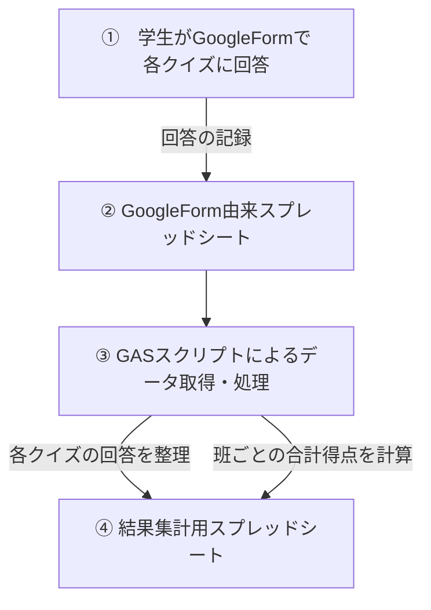

# 🚀 2025FC Quiz Point Scoring (Using GAS)

##  概要
このリポジトリは、Google Apps Script (GAS) を使用して、オリエンテーリングのQuizポイントのスコアを集計するシステムを管理するためのものです。

##  機能
- 各チェックポイントのスコアを集計
- 班ごとの合計得点を計算
- Google スプレッドシートと連携してデータを整理
- 実行履歴の記録

## 🛠 使用方法
1. Google Apps Script のエディタで新しいプロジェクトを作成
2. `collectCheckpointResults.js` のコードをコピーして貼り付け
3. **スプレッドシートのIDを設定**
   - GASコード内の `集計スプレッドシートのID`、`名簿スプレッドシートのID`、 の部分にスプレッドシートのIDを入力してください。
   - 各QuizポイントのスプレッドシートIDも適宜変更してください。
4. 必要に応じて `summarizeTotalScores.js` も追加
5. スクリプトを実行してスコアを集計

## 🚀 システム構成図

①：キャンパス内に貼られたQRcodeを想定しています。(クイズ数＝QRcode数＝GoogleForm数)。

②：①で使用しているGoogleFormから生成されるスプレッドシートです。(QRcode数＝GoogleForm数＝スプレッドシート数)。

③-1：名簿スプレッドシートの班分け情報を利用して、班の中で一番早く回答した人の情報(回答時間、メールアドレス、班番号、スコア)を抽出し、「結果集計用スプレッドシート」へクイズ毎にシートを生成。

③-２：班毎の合計スコアをまとめ、「結果集計用スプレッドシート」へシートを生成。

## 📂 GASスクリプト(QuizPointResults.js)の構成
- `collectCheckpointResults.js` - 各チェックポイントのスコアを取得・集計
- `summarizeTotalScores.js` - 各班の合計得点を計算し、最終結果を記録

## 📝 注意事項
- Google Apps Script の「スクリプトプロパティ」機能を活用すると、スプレッドシートIDを直接コードに記載せずに管理できます。
- **スプレッドシートのIDを公開リポジトリに含めないよう注意してください。**
- スプレッドシートの権限設定を適切に行い、スクリプトがデータを読み書きできるようにしてください。

## 📢 変更履歴
- **v1.0** - 初回リリース（基本的なスコア集計機能を実装）

## 📧 問い合わせ
ご質問やフィードバックがありましたら、Issue を作成するか、リポジトリ管理者までご連絡ください！

